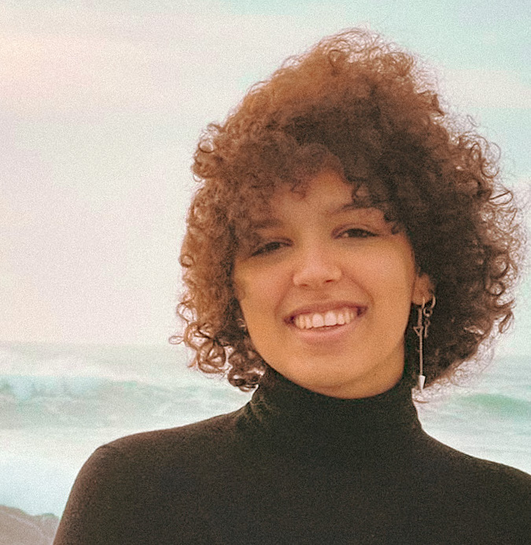

# Áurea Laranja {:class="img-photo"}
Software Engineering student. 

&#128231; <a href="mailto:aurealaranja@gmail.com">aurealaranja@gmail.com</a>
| &#9743; <a href="tel:+351938655551">+351 938655551</a>
| &#127757; <a href="https://aurealaranja.github.io/cv/">aurealaranja.github.io/cv</a>

## Software Enginnering student at UTAD

**Second year student of [Software Engineering BSc at UTAD](https://www.utad.pt/estudar/en/cursos/informatics-engineering/), Portugal.   
Interested in Algorithms, OOP and Software Engineering Methodologies.**

### Relevant Courses

 - Procedural Programming (C language)
 - Programming Laboratory (C language)
 - Object Oriented Programming (C++ language)
 - Programming Laboratory II (C++ language)
 - Software Engineering (UML, Agile and Engineering concepts)
 - Organizational Engineering (Systems Engineering)
 - Compilers (yacc, lex, regex)
 - Statistics
 - Physics
 - Multiplatform Programming (C#, .NET core)
 - Programming Laboratory III (C#, Xamarin, MVC)
 - Data Structures and Algorithms 
 - Databases 
 - Data Communication
 

### Proficiency

| <!-- -->  | <!-- --> |
| --------------------   | ---------------------------------- |
| **C**                  | &#9733;&#9733;&#9733;&#9734;&#9734;|
| **C++**                | &#9733;&#9733;&#9733;&#9733;&#9734;|
| **Python**             | &#9733;&#9733;&#9734;&#9734;&#9734;|
| **C#**                 | &#9733;&#9733;&#9734;&#9734;&#9734;|
| **SQL**                | &#9733;&#9733;&#9734;&#9734;&#9734;|
| **Markdown**           | &#9733;&#9733;&#9733;&#9734;&#9734;|
| **Git**                | &#9733;&#9733;&#9733;&#9734;&#9734;|
| **Team leading**       | &#9733;&#9733;&#9733;&#9733;&#9734;|
| **UML**                | &#9733;&#9733;&#9733;&#9733;&#9734;|
| **Collaborative work** | &#9733;&#9733;&#9733;&#9733;&#9734;|

## Other Interests and Projects

__Founding and managing the [TugaPride](http://tugapride.com/) project__
  - Founder and presenter
  - Development of the website

__Traveling__
  - Interrail through Europe by myself when I was 18
  - Visiting many countries in Europe, Asia and Africa
  - Part of the crew of the ship [UAM Creoula](https://en.wikipedia.org/wiki/UAM_Creoula) for one week (Lisbon - Berlengas - Oporto)

__12 years of Contemporany Dance with multiple live presentations and exams__
  - Responsible for choreographing live acts
  - Ballerina 

__Student Organizations__
  - For 2 years I was part of the Highschool Student Organization
  - For 2 years I was part of the Software Engineering Student Organization

__Multiple years attending [Universidade Júnior](https://universidadejunior.up.pt/)__
  - Theater and preforming arts
  - Software Engineering
  - Engineering Challenge
  - Science Challenge

## Education

`2019 - now`
__Software Enginnering BSc__
- [Universidade de Trás-os-Montes e Alto Douro](https://www.utad.pt/estudar/en/cursos/informatics-engineering/), Portugal. 

`2021`
__Python Programming: A Concise Introduction - Wesleyan University - Coursera__
- [Certified](https://www.coursera.org/account/accomplishments/verify/DHW8AUD8KW2P?utm_source=ln&utm_medium=certificate&utm_content=cert_image&utm_campaign=sharing_cta&utm_product=course) programming course on Python programming.

`2016 - 2019`
__Escola Secundária Eça de Queiroz__
- Best Portuguese Public Highschool in 2018.

## &nbsp;

<em style="font-weight: 100;font-style: italic;color: #999;font-size: 80%;">Last updated: March 2021</em>

